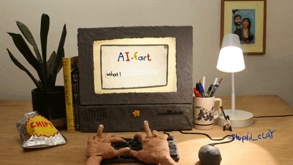

  

<h1 align="center">Hey 👋, I'm Adeoluwa Oyinlola!</h1>
<h3 align="center">AI Researcher | Machine Learning Engineer | Applied Scientist</h3>

  
  
  

---

### 🧠 Glad to see you here!

I'm a passionate **AI engineer and researcher** who loves exploring the intersection of **machine learning, IoT, and applied science**.  
I enjoy turning research concepts into working systems that make real-world impact — in **healthcare, agriculture, and intelligent sensing**.

---

### 💬 Talking About Personal Stuff

<table>
<tr>
<td>

### 👋 Hey, I'm Adeoluwa Oyinlola  
AI Researcher | ML Engineer | Applied Scientist  
Building AI that bridges research and real-world impact.

</td>
<td>
  
</td>
</tr>
</table>

- 🔭 I’m currently researching **AI for Sustainable Agriculture** at **UCL (University College London)**.  
- 🚀 I’m exploring **deep learning**, **computer vision**, and **edge analytics**.  
- 💻 Most of my projects are available here on [GitHub](https://github.com/Adeoluwa2).  
- 💬 Ask me about **machine learning**, **medical imaging**, or **IoT analytics** — I love to help.  
- 🎓 I recently earned an **MSc in Applied AI (Distinction)** from **London South Bank University**.  
- ⚡ Fun fact: My first RF sensing prototype worked after 27 failed iterations — persistence > luck.  
- 📫 Reach me at **[adeoluwaoyinlola@gmail.com](mailto:adeoluwaoyinlola@gmail.com)**  

---

### 💻 My Absolute Favorites

- 🧩 Building real-world AI systems — not just Kaggle notebooks.  
- 🧠 Reading about neuroscience-inspired AI.  
- 🍕 Connecting data science with human impact.  
- 🎯 Mentoring AI enthusiasts and open-source contributors.  

---

### 🛠️ Languages and Tools

---

### 📦 Featured Projects

**[Smart Garbage Classifier](https://github.com/Adeoluwa2/smart-garbage-classifier)**  
🧠 A neural network–based garbage classification system achieving **95% accuracy**.  
Built with **Python, Taipy, and Matplotlib** to automate waste sorting intelligently.

---

**[Diabetes Prediction Model](https://github.com/Adeoluwa2/diabetes-prediction)**  
📊 Machine learning system predicting diabetes onset using clinical data.  
Implemented with **pandas**, **scikit-learn**, and **TensorFlow**, achieving **92% accuracy** and reducing error by 30%.

---

**[Cassava Vision System](https://github.com/Adeoluwa2/cassava-vision-system)**  
🌾 AI-powered **RF reflectometry** and vision-based analysis for cassava crop quality sensing.  
Part of ongoing **IEEE BioSENSORS 2025** research; integrates **computer vision** and **AI-based frequency selection**.

---

### ⚡ GitHub Stats

  
   
  

---

### ⚙️ Things I Use to Get Stuff Done

- 💻 **OS:** Windows 11  
- 🧠 **Editor:** VSCode  
- 🌐 **Browser:** Brave / Chrome  
- 🔧 **Hardware:** Dell Latitude (i5)  
- 📚 **Resources:** arXiv, Medium, PapersWithCode, IEEE Xplore  

---

---

---

<h3>✨ If you like my work, don't forget to <a href="https://github.com/Adeoluwa2?tab=repositories">⭐ star my repositories</a>!</h3>

